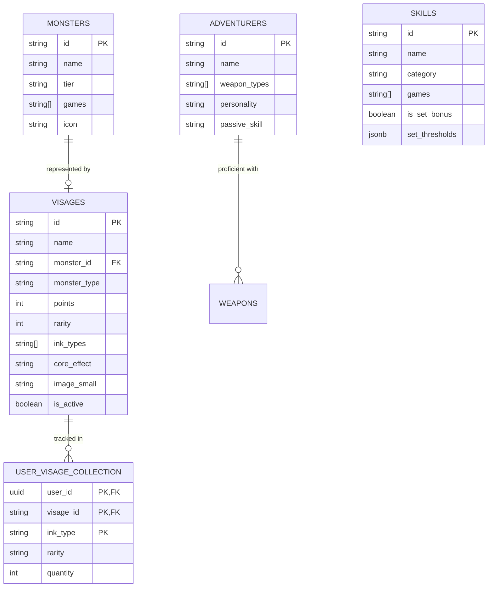

# Monster Hunter Outlanders (MHO) — Data Architecture & Knowledge Base

> **Central Knowledge Base & Technical Reference**  
> This document maintains the verified data structures, database schemas, relations, and domain rules for **Monster Hunter Outlanders** (MHO) features within the Field Guide project. It serves as the single source of truth for schema design, admin tools, ingestion pipelines, and future feature implementations.

---

## 1. Game Overview & System Context

| Attribute | Details |
| :--- | :--- |
| **Full Title** | Monster Hunter Outlanders |
| **Game Code / Identifier** | `mho` |
| **Developer / Publisher** | TiMi Studio Group (Tencent) × Capcom |
| **Platforms** | iOS, Android |
| **Setting** | **Aesoland** — a seamless, persistent open-world continent |
| **Current Status** | Closed Beta (Mid-2026) |
| **Core Distinctions** | • Named **Adventurer** characters with unique kits (replaces blank hunter avatars)<br>• **Radiant Monsters** altered by **Radiantite** mineral (can enter frenzied state)<br>• **Visage Cards** card/equipment build mechanic replacing or complementing traditional armor systems<br>• Up to 4-player co-op multiplayer |

---

## 2. Visage Cards — Deep-Dive Specification

### 2.1 Concept & In-Game Role
Visage Cards represent the soul or essence of hunted monsters (both Small and Large monsters). Hunters equip Visage Cards into loadouts with point-capacity budgets. Each Visage card grants:
1. **Core Effect**: An inherent passive skill effect specific to that monster's card.
2. **Ink Roll**: When acquired, the card rolls 1 of its predefined **Ink Types** (out of 1–3 available in its pool).
3. **Set Bonus Contribution**: Equipping multiple cards bearing matching Inks activates multi-piece Set Bonuses (e.g. 2-piece, 4-piece effects).

---

### 2.2 Database Schema (`public.visages`)

Defined in Supabase migrations (`20260828000001_create_visages_table.sql` and `20260829000001_rename_visage_description_to_core_effect.sql`):

```sql
CREATE TABLE IF NOT EXISTS public.visages (
  id            TEXT        PRIMARY KEY,     -- Normalized slug, e.g. 'mernos', 'great_jagras'
  name          TEXT        NOT NULL,        -- Display name, e.g. 'Mernos'
  name_ja       TEXT,                        -- Japanese localized name, e.g. 'メルノス'
  monster_id    TEXT,                        -- Optional FK/reference to public.monsters(id)
  monster_type  TEXT        NOT NULL DEFAULT 'small'
                CHECK (monster_type IN ('small', 'large')),
  points        INTEGER     NOT NULL DEFAULT 1, -- Loadout point cost / allocation (0-99)
  rarity        INTEGER     NOT NULL DEFAULT 1, -- Card rarity grade (1-10)
  ink_types     TEXT[]      NOT NULL DEFAULT '{}', -- Pool of 1-3 allowed ink types
  image_small   TEXT,                        -- Supabase storage / CDN URL for collection icon
  core_effect   TEXT,                        -- Inherent passive effect description
  is_active     BOOLEAN     NOT NULL DEFAULT TRUE, -- Public visibility toggle
  notes         TEXT,                        -- Internal notes/lore
  sort_order    INTEGER     NOT NULL DEFAULT 0,
  created_at    TIMESTAMPTZ NOT NULL DEFAULT now(),
  updated_at    TIMESTAMPTZ NOT NULL DEFAULT now()
);
```

#### TypeScript Entity Definition (`src/data/schemas/visage.ts`)
```typescript
export type VisageMonsterType = 'small' | 'large';

export interface DBVisage {
  id: string;
  name: string;
  name_ja: string | null;
  monster_id: string | null;
  monster_type: VisageMonsterType;
  points: number;
  rarity: number;
  /** Pool of 1-3 ink types this card can randomly roll in-game */
  ink_types: InkType[];
  image_small: string | null;
  /** Inherent / Core Effect of this Visage card */
  core_effect: string | null;
  is_active: boolean;
  notes: string | null;
  sort_order: number;
  created_at: string;
  updated_at: string;
}

export type VisageUpsert = Omit<DBVisage, 'created_at' | 'updated_at'>;
```

---

### 2.3 Ink System & Supported Inks

Visage Cards derive set bonuses through **Inks**. A card has a pool of 1 to 3 possible Inks that it can roll upon drop.

#### Supported Ink Types (`src/data/schemas/visage.ts`)

| Ink Identifier (`InkType`) | Display Name | Theme Colors | Lucide Icon | Description / Affinity |
| :--- | :--- | :--- | :--- | :--- |
| `might` | Ink of Might | Red (`#ef4444`) | `sword` | Raw Attack Power / Damage |
| `flames` (alias `fire`) | Ink of Flames | Amber / Orange (`#f59e0b`) | `flame` | Fire Elemental Affinity |
| `water` | Ink of Water | Sky Blue (`#38bdf8`) | `droplet` | Water Elemental Affinity |
| `thunder` | Ink of Thunder | Yellow (`#facc15`) | `zap` | Thunder Elemental Affinity |
| `combat` | Ink of Combat | Rose (`#e11d48`) | `swords` | Martial & Combat Flow |
| `guidance` | Ink of Guidance | Emerald (`#10b981`) | `link` | Team Buffs & Synergy |
| `grace` | Ink of Grace | Teal (`#2dd4bf`) | `sparkles` | Evasion & Agility |
| `ice` | Ink of Ice | Cyan (`#06b6d4`) | `snowflake` | Ice Elemental Affinity |
| `dragon` | Ink of Dragon | Purple (`#a855f7`) | `sparkles` | Dragon Elemental Power |
| `poison` | Ink of Poison | Fuchsia / Dark Purple (`#c026d3`) | `skull` | Poison Status Buildup |
| `paralysis` | Ink of Paralysis | Gold / Amber (`#fbbf24`) | `zap` | Paralysis Status Effect |
| `sleep` | Ink of Sleep | Indigo (`#6366f1`) | `moon` | Sleep Status Effect |
| `blast` | Ink of Blast | Orange (`#ea580c`) | `flame` | Blast Status / Explosions |
| `resonance` | Ink of Resonance | Deep Emerald (`#059669`) | `activity` | Frequency / Sonic / Resonance |
| `protection` | Ink of Protection | Ocean Sky (`#0284c7`) | `shield` | Defense & Damage Mitigation |

---

### 2.4 Mechanics: Core Effects vs. Set Bonuses

```
┌─────────────────────────────────────────────────────────────┐
│                    VISAGE CARD INSTANCE                     │
│                                                             │
│  [Card Art / Monster Identity]       [Points Cost: 1-3]     │
│                                                             │
│  ┌───────────────────────────────────────────────────────┐  │
│  │ 1. Core Effect (Inherent Passive)                     │  │
│  │    "When health is above 70%, increases attack by 10%" │  │
│  └───────────────────────────────────────────────────────┘  │
│                                                             │
│  ┌───────────────────────────────────────────────────────┐  │
│  │ 2. Rolled Ink Type (e.g. "Ink of Thunder")            │  │
│  │    Points towards matching Set Bonus:                 │  │
│  │    • 2-Piece: +10% Thunder Attack                     │  │
│  │    • 4-Piece: Shockwave burst on charged attacks      │  │
│  └───────────────────────────────────────────────────────┘  │
└─────────────────────────────────────────────────────────────┘
```

1. **Core Effect (`core_effect`)**:
   - Unique inherent passive text directly on the card.
   - Always active as long as the card is equipped in the loadout.
   - Examples: Flat stat increase, conditional attack boost, specific weapon action trigger.

2. **Inks & Set Bonuses (`ink_types` -> Set Bonuses)**:
   - Visage cards possess a pool of 1 to 3 possible Inks (`ink_types`).
   - Cards do not carry a hardcoded `set_bonus_id`; instead, the rolled Ink type dynamically activates the corresponding Ink Set Bonus (e.g. `Ink of Thunder` activates the Thunder set thresholds).
   - Set bonus thresholds are stored in `public.skills` with `games @> ARRAY['mho']`:
     ```json
     [
       { "pieces": 2, "description": "Increases Thunder Attack by 50." },
       { "pieces": 4, "description": "Attacks trigger additional Thunder chain damage." }
     ]
     ```

---

### 2.5 Ingestion & Card Importer Pipeline

The project includes an automated OCR and ingestion pipeline (`scripts/card_importer/process_cards.py`):

1. **Input Screenshot**: Reads in-game screenshots of Visage cards.
2. **Gemini Vision OCR**: Extracts:
   - Card Title (`Visage: <Monster Name>`)
   - Monster Identifier & Tier (`small` / `large`)
   - Point Cost (`points`)
   - Rarity (`rarity`)
   - Core Effect Title & Description (`core_effect`)
   - Detected Inks / Set Effects (`ink_types`)
3. **Image Processing & Storage**:
   - Crops square monster icon (`image_small`).
   - Uploads to Supabase Storage bucket `visages` under `visages/small/`.
4. **Database Upsert**: Executes Supabase upsert into `public.visages`.

---

### 2.6 Visage Card Rarities & Hunter Collection System

Visage Cards exist in **4 official Card Rarity Grades**. Hunters collect cards from hunts and gacha pulls, upgrading their album with higher rarity copies.

#### The 4 Card Rarity Tiers

| Rarity Tier | Identifier | Color Theme | Visual Styling | Card Background | Border & Hover Glow |
| :--- | :--- | :--- | :--- | :--- | :--- |
| **Fine** | `fine` | **Green** | Emerald Parchment | Soft Green Gradient (`#e3f4dd` → `#b8ddae`) | Dark Green (`#508d44`) with emerald glow on hover (`rgba(34, 197, 94, 0.45)`) |
| **Rare** | `rare` | **Blue** | Sapphire / Azure | Light Blue Gradient (`#d9ebfb` → `#a2c8ee`) | Dark Blue (`#3c74b1`) with sky-blue glow on hover (`rgba(56, 189, 248, 0.45)`) |
| **Epic** | `epic` | **Purple** | Royal Violet | Lavender / Purple Gradient (`#eeddfb` → `#c598e7`) | Deep Purple (`#8244b0`) with violet glow on hover (`rgba(168, 85, 247, 0.5)`) |
| **Superior** | `superior` | **Gold / Yellow** | Ancient Gold Parchment | Radiant Amber/Gold Gradient (`#f3e5be` → `#cfba84`) | Rich Gold (`#8e7646`) with amber glow on hover (`rgba(234, 179, 8, 0.5)`) |

#### Collection Tracking Rules
1. **Highest Rarity Priority**:
   - Hunters only track their single highest rarity for any given Visage card in their collection.
   - Example: If a hunter owns 2 copies of a **Rare** Barioth card and subsequently acquires an **Epic** Barioth card, the collection entry updates to **Epic** and starts at count **1** until increased.
2. **Quantity Capacity (1 to 5+)**:
   - The collection tracks quantity from **1 to 5**, where **5** represents **5+** (hunters do not need to track beyond 5 copies).
3. **Card Visual States**:
   - **Unowned / Unselected**: Card renders muted and dimmed (`opacity-40 grayscale`).
   - **Owned**: Card renders in full color matching its active rarity background tint, and on mouse hover brightens around the borders with that specific rarity's color glow.
4. **Interactive Card Badges**:
   - **Rarity Ball**: Clicking the circular rarity dot opens a popup window to select from the 4 rarity tiers or remove the card from collection.
   - **Quantity Ball**: Clicking the circular count ball opens a popup window to select counts `1`, `2`, `3`, `4`, or `5+`.

#### Database Schema (`public.user_visage_collection`)
Defined in Supabase migration `20260829000002_create_user_visage_collection.sql`:

```sql
CREATE TABLE IF NOT EXISTS public.user_visage_collection (
  user_id     UUID        NOT NULL REFERENCES auth.users(id) ON DELETE CASCADE,
  visage_id   TEXT        NOT NULL REFERENCES public.visages(id) ON DELETE CASCADE,
  ink_type    TEXT        NOT NULL,
  rarity      TEXT        NOT NULL CHECK (rarity IN ('fine', 'rare', 'epic', 'superior')),
  quantity    INTEGER     NOT NULL DEFAULT 1 CHECK (quantity >= 1 AND quantity <= 5),
  created_at  TIMESTAMPTZ NOT NULL DEFAULT now(),
  updated_at  TIMESTAMPTZ NOT NULL DEFAULT now(),
  PRIMARY KEY (user_id, visage_id, ink_type)
);
```

---

## 3. Related MHO Entities & Schema Relationships



### 3.1 Monsters (`public.monsters`)
- Monsters tagged with `'mho' = ANY(games)`.
- Categorized into `small` and `large` tiers.
- **Radiant Variants**: Future variants under `MHORadiantMonster` (`src/data/games/mho/monsters.ts`) specify `parentId`, `radiantiteLevel` (1–3), and `hasFrenziedState`.

### 3.2 Skills & Set Bonuses (`public.skills`)
- MHO Skills and Set Inks are tagged with `games = ARRAY['mho']`.
- Set bonuses utilize `is_set_bonus = true` with 2-piece / 4-piece `set_thresholds`.
- Categories: `attack`, `critical`, `defense`, `survival`, `status`, `utility`, `health`, `general`.

### 3.3 Adventurers (`public.adventurers`)
- **Playable Characters**: Distinct heroes of Aesoland with unique backstories, combat roles, elemental specializations, and weapon disciplines.
- **Attributes**: `id`, `name`, `name_ja`, `image`, `is_default`, `weapon_type`, `allowed_weapon_types`, `element_specialization`, `role`, `description`, `notes`, `is_active`, `sort_order`.
- **Player Character (`is_default: true`)**:
  - The customizable hunter created by the player.
  - Can freely equip and switch between all 14 weapon types.
  - Always unlocked and recruited by default.
- **Combat Roles**:
  - `Assault` (Red): High burst/sustained offensive damage and part breaks.
  - `Disrupter` / `Disruptor` (Purple): Crowd control, status ailments, staggers, and monster interrupts.
  - `Support` (Emerald): Party healing, defense buffs, and utility aid.
- **Hunter Roster Recruitment Tracking (`public.user_adventurer_collection`)**:
  - Primary Key: `(user_id, adventurer_id)`.
  - Tracks recruited companion adventurers in personal field guide.
  - Unrecruited cards display dimmed/muted (`opacity-50 grayscale`); recruited adventurers display full-color with role/element borders and a green recruited badge.
- **UI Surfaces**:
  - **Investigation Notes -> Adventurers (`AdventurerGuide.tsx`)**: Public guide with recruitment metrics (`X / Total` recruited, percentage progress bar, role breakdown), default character weapon switcher palette, ownership filter (`All | Recruited | Missing`), role & element & weapon filters, search, grid/table view modes, and full inspection modal (`AdventurerModal.tsx`).
  - **Admin Panel -> Adventurers (`AdventurerManager.tsx`, `AdventurerEditModal.tsx`)**: Full CRUD, active toggling, and image upload.

### 3.4 Weapons & Equipment Armory (`public.weapons` & `public.weapon_types`)
- **14 Core Franchise Archetypes (`public.weapon_types`)**:
  - **Melee (11)**: `great_sword`, `long_sword`, `sword_shield`, `dual_blades`, `hammer`, `hunting_horn`, `lance`, `gunlance`, `switch_axe`, `charge_blade`, `insect_glaive`.
  - **Ranged (3)**: `bow`, `light_bowgun`, `heavy_bowgun`.
  - **Game Availability (Admin -> Other / `OtherManager.tsx`)**:
    - **Monster Hunter Now (MHN)**: All 14 weapon types available.
    - **Monster Hunter Outlanders (MHO)**: Currently 6 confirmed beta weapons (`lance`, `long_sword`, `dual_blades`, `great_sword`, `heavy_bowgun`, `bow`).
- **Craftable Equipment Weapons (`public.weapons`)**:
  - **Table**: `public.weapons`
  - **Attributes**: `id`, `game`, `name`, `name_ja`, `weapon_type_id`, `monster_id` (optional), `source_type` (`monster`, `ore`, `bone`, `event`, `general`), `element_type` (`raw`, `fire`, `water`, `thunder`, `ice`, `dragon`, `poison`, `paralysis`, `blast`, `sleep`), `skills` (JSONB array with `unlock_rarity`), `special_skill`, `image`, `description`, `notes`, `is_active`, `sort_order`.
  - **Attached Skills**: Supports unlocking skills at specific upgrade rarities (e.g. `Base`, `R6`, `R8`, `R9`, `R12`).
  - **Hunter Weapon Collection Tracking (`public.user_weapon_collection`)**:
  - Primary Key: `(user_id, weapon_id)`
  - Tracks forged/owned equipment weapons in personal field guide.
  - Uncollected cards display dimmed/muted (`opacity-60 grayscale`); collected weapons display full-color with vibrant borders and a green "Collected" badge.
- **UI Surfaces**:
  - **Investigation Notes -> Weapons (`WeaponGuide.tsx`, `WeaponCard.tsx`, `WeaponModal.tsx`)**: Public armory catalog with forged progress metrics (`X / Total` collected, progress bar percentage), ownership filter (`All | Collected | Missing`), game/type/element/source filters, search, grid/table view modes, and full inspection modal.
  - **Admin Panel -> Weapons (`WeaponEquipmentManager.tsx`, `WeaponEditModal.tsx`)**: Full CRUD for creating/editing equipment weapons, drag & drop image uploads, source/element filters, monster association, and grid/table view modes.
  - **Admin Panel -> Other (`OtherManager.tsx`)**: Manages the 14 core weapon types and game availability matrix.

### 3.5 Buddies / Companions (`public.buddies`)
- **Tiers**: `SSR` (Gold/Amber), `SR` (Purple/Violet), `R` (Blue/Azure).
- **Combat Roles**: `Assault` (direct damage), `Disruptor` (CC/status/stagger), `Support` (healing/defense/buffs).
- **Attributes**: `id`, `name`, `name_ja`, `tier`, `role`, `core_passive`, `image`, `is_active`, `notes`, `sort_order`.
- **Hunter Collection Tracking (`public.user_buddy_collection`)**:
  - Primary Key: `(user_id, buddy_id)`
  - Tracks owned companions and quantity capacity from **1 to 5** (where 5 represents 5+).
  - Unowned cards display dimmed/muted (`opacity-50 grayscale`); owned cards display full-color with vibrant tier borders and quantity indicator ball.
- **UI Surfaces**:
  - **Investigation Notes -> Buddies (`BuddyGuide.tsx`)**: Public guide with collection metrics (`X / Total`), ownership filter (`All | Owned | Missing`), tier/role filters, search, grid/table view modes, and full inspection modal (`BuddyModal.tsx`).
  - **Admin Panel -> Buddies (`BuddyManager.tsx`, `BuddyEditModal.tsx`)**: Full CRUD and active visibility toggling.

### 3.6 Armour Pieces & Upgrade Rarity Skill Unlocks (`public.armour_pieces`)
- **Table**: `public.armour_pieces`
- **Slot Identifiers**: `helm`, `chest`, `gloves`, `waist`, `greaves`.
- **Set Variants & Sets**: Supports multiple variants per monster (`Set I`, `Set VII`, `Alpha`, `Beta`, etc.) with custom display names.
- **Skill Unlock Rarity / Upgrade Levels (`ArmourSkill`)**:
  - Some skills on armour pieces are only unlocked once the armour piece is upgraded to a specific rarity / grade level (e.g. `Rarity 6`, `Rarity 8`, `Rarity 9`, `Rarity 12`).
  - Stored inside the `skills` JSONB column as:
    ```json
    [
      { "id": "water_attack", "level": 1, "unlock_rarity": null },
      { "id": "evade_extender", "level": 1, "unlock_rarity": 9 },
      { "id": "water_attack", "level": 2, "unlock_rarity": 12 }
    ]
    ```
  - Base skills (`unlock_rarity = null` or `1`) are available immediately upon forging.
  - Higher-tier skills or additional levels activate once upgraded to that required rarity level (`R6+`, `R9+`, `R12+`).
- **UI Surfaces**:
  - **Admin Panel -> Armour Builder (`MonsterArmourBuilder.tsx`)**: Individual piece skill cards display interactive rarity unlock badges (`🔒 R9`, `⚡ R12`, or `Base`). Clicking the badge opens a quick popup to adjust or set the required rarity level.
  - **Add Skill & Bulk Broadcaster**: Add Skill popover and Bulk Apply modal include unlock rarity selection chips (`Base`, `R6`, `R8`, `R9`, `R12`, or custom input).
  - **Skill-to-Armour Mapping View (`SkillArmourMappingView.tsx`)**: Displays and modifies the unlock rarity for each piece granting a specific skill.
  - **Card Importer (`process_armour.py`)**: Gemini Vision OCR prompt extracts `unlock_rarity` and writes it to `armour_pieces`.

---

## 4. Extensibility Roadmap for Future MHO Features

When expanding the Field Guide with new MHO game elements, adhere to these structural conventions:

### 4.1 Visage Loadout & Build Planner
- **Point Budget Constraint**: Total equipped Visage cards cannot exceed hunter point limit (e.g. 10 points).
- **Ink Synergy Calculator**: Dynamically sum equipped card Inks and highlight active 2-piece and 4-piece set bonus tiers.
- **Adventurer + Weapon + Visage Synergy**: Combine Adventurer passives, Weapon elemental damage, and Visage core passives.

### 4.2 Gacha & Ingestion Conventions
- **Naming Pattern**: Always use lowercase snake_case for Visage IDs matching monster slugs (`pukei_pukei`, `great_girros`, `mernos`).
- **Ink Pool Updates**: When new in-game inks are discovered, register them in `src/data/schemas/visage.ts` (`InkType`, `INK_CONFIG`, `INK_OPTIONS`) and add corresponding Set Bonus entries in `public.skills`.
